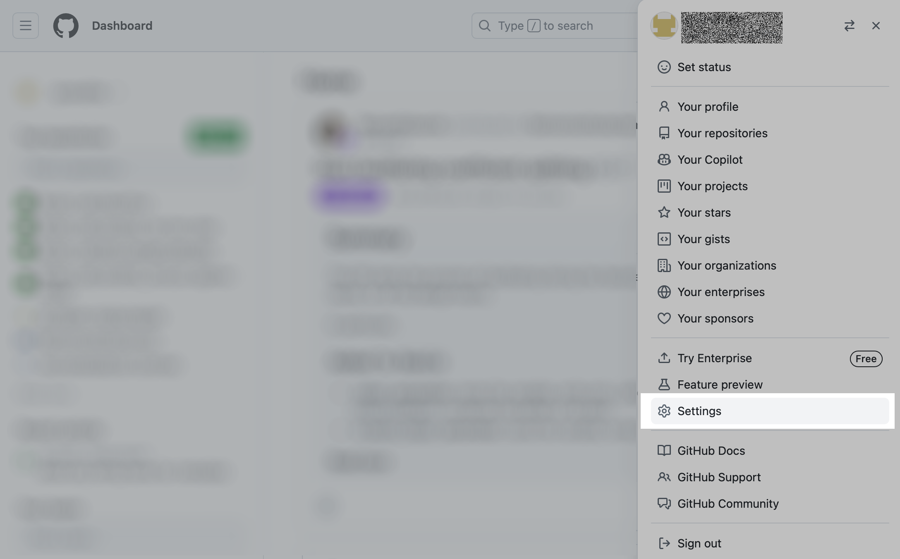
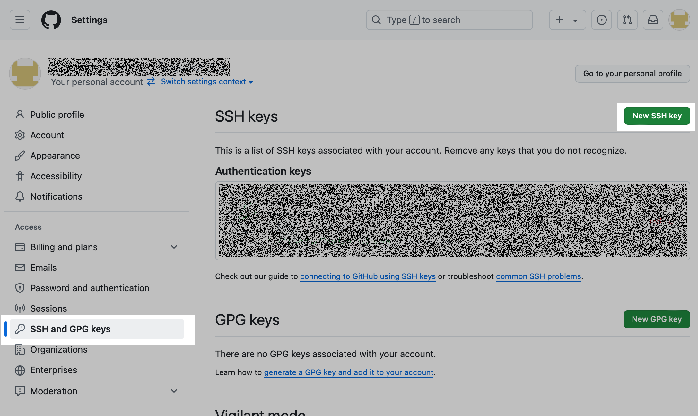
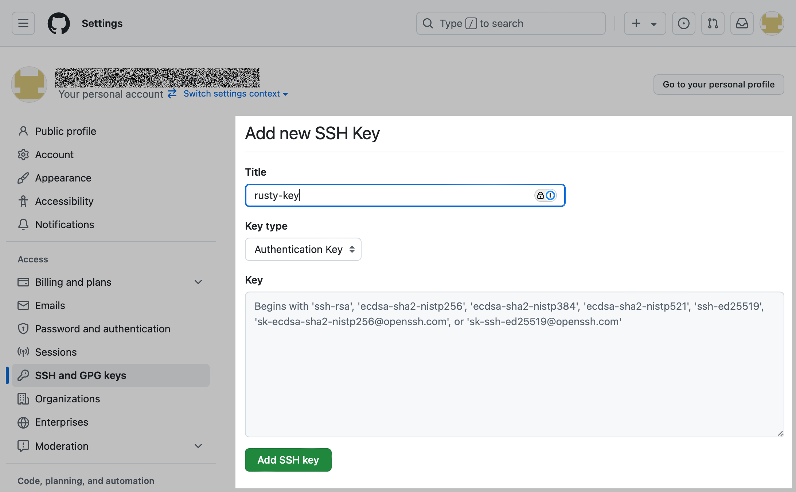

# nsl-tutorials
Repository containing instructions and example notebooks to orient lab members with different datasets and common analysis pipelines

## Installation on cluster
### 1. Download repository
#### 1.1 Connect to rusty
If you're on the guest network or offsite, you need to first connect to flatiron gateway before connecting to rusty. Enter the following command in your terminal,
```bash
ssh -p 61022 user@gateway.flatironinstitute.org
```
which will prompt for googe authenticator code and cluster password. Once you're connected, or if you're on the FI network, you can connect to rusty with the command:
```bash
ssh rusty
```
This will bring you to a login node in your home folder.

#### 1.2 Generate ssh key 
Since this is a private repository, we need to set up access in order to clone it. To do so, generate a new ssh key pair, replacing "user@example.com" with your github email address:
```bash
ssh-keygen -t ed25519 -C “user@example.com”
```
which will return the text
```
Generating public/private ed25519 key pair.
Enter file in which to save the key (/mnt/home/user/.ssh/id_ed25519):
```
Press enter to accept the save location, after which it will prompt for a passphrase, which you will need to enter twice.
```
Enter passphrase (empty for no passphrase): 
Enter same passphrase again:
```
It will then print out a string of random characters and a randomart image. You should now have two new files which can be listed with the command `ls ~/.ssh`:
```
id_ed25519  id_ed25519.pub
```
The first file, `id_ed25519`, is your private key which should be kept confidential. The second file, `id_ed25519.pub`, is your public key which we will save in GitHub. Print this key to the terminal with
```
cat ~/.ssh/id_ed25519.pub
```
This key will have the form:
```
ssh-ed25519 xxxxxxxxxxxxxxxxxxxxxxxxxxxxxxxxxxxxxxxxxxxxxxxxxxxxxxxxxxxxxxxxxxxx user@example.com
```
Copy this full output from your terminal for the next step.

#### 1.2 Save public key in github
From the GitHub home page, navigate to your user settings by clicking on the top right icon
</img>
and selecting "settings" in the right sidebar.
</img>
From there, select "SSH and GPG keys" and click the "New SSH key" in the upper right.
</img>
You'll navigate to a form where you need to give your new SSH key a name, such as "rusty-key", and paste the public key from the previous step in the "Key" box.
</img>
Click "Add SSH key" to add this key to your account.

#### 1.3 Clone repository to cluster
In your home folder on rusty, you can now clone the "nsl-tutorials" repository. Use the following commands to load the git module and clone the repository.
```bash
module load git
git clone git@github.com:neurostatslab/nsl-tutorials.git
```
This will download the repository into a new directory `nsl-tutorials`.

### 2. Set up python virtual environment on cluster
We'll want to set up a new python virtual environment and set it as a jupyter kernel in order to access the tutorial notebooks. First, load the python module:
```bash
module load python
```
which will load the default python version (3.10.13 at the time of writing). Then, create the virtual environment `nsl-data` using the following command
```bash
python -m venv --system-site-packages venvs/nsl-data
```
which will create the environment in a subdirectory `venvs` in your home directory. You can change this location if you want to use a different location, or if you have an existing location where you keep your virtual environments. The `--system-site-packages` flag will include default packages already installed on the cluster, such as numpy and scipy, which will save storage space over having a separate install of each of these packages. 

Activate the environment you just created with the command
```bash
source venvs/nsl-data/bin/activate
```
after which, you should see the text `(nsl-data)` prepended to the current line in your terminal. Now you can safely install the remaining dependencies.

The nsl-tutorials repository has been set up to be locally pip-installable for easy installation of the remaining dependencies. Navigate to the cloned repository with `cd nsl-tutorials`. Once inside the folder, install the nsl-tutorials "package" with the following command:
```bash
pip install -e .
```
Using `.` installs the package found in the current directory, and the `-e` flag tells pip to install in "edit" mode. This will allow the install to update with any changes locally or pulled from GitHub.

Finally, we need to set this virtual environment as a jupyter kernel in order to use it in a jupyter notebook. Load the jupyter-kernels module and create the custom kernel with the following command:
```
module load jupyter-kernels
python -m make-custom-kernel nsl-data
```
### 3. Run Jupyter notebooks on the cluster
The easiest way to run Jupyter notebooks on cluster resources is to use Flatiron's JupyterHub environment found at: https://jupyter.flatironinstitute.org/. 

SCC documentation on using JupyterHub can be found here: https://wiki.flatironinstitute.org/SCC/JupyterHub. However, if you followed the above instructions to set up a jupyter kernel, you should be good to go. 

JupyterHub will open the Jupyter server in your home folder on the cluster. If you want easy access to files in the neurstatslab group folder, you can create a symbolic link to the folder by entering the following command in a terminal in your home folder:
```
ln -s /mnt/home/neurostatslab neurostatslab
```
Listing files and directories in your home folder with `ls` should now show the neurostatslab folder.


